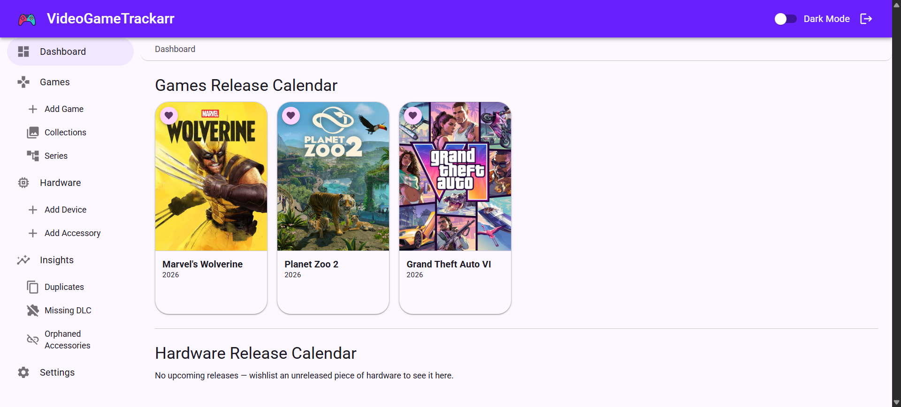
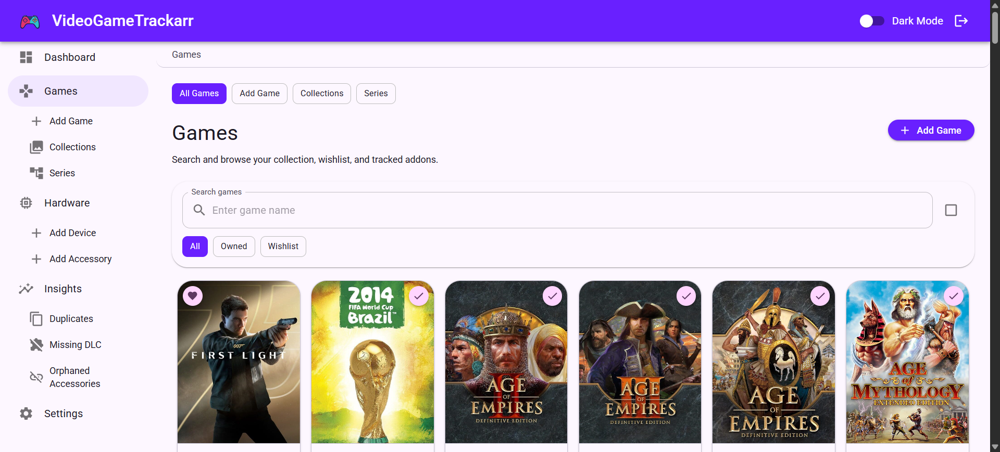
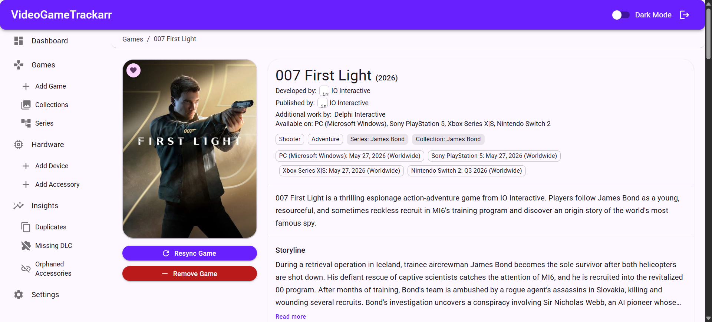
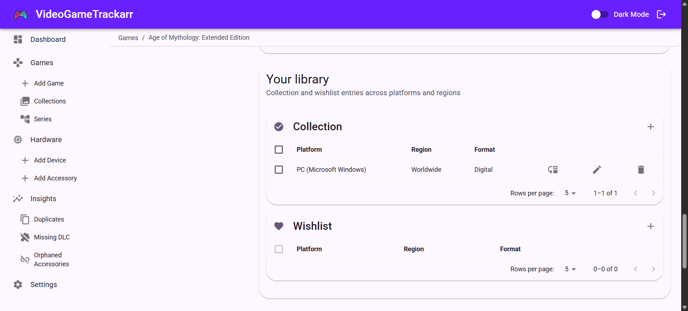
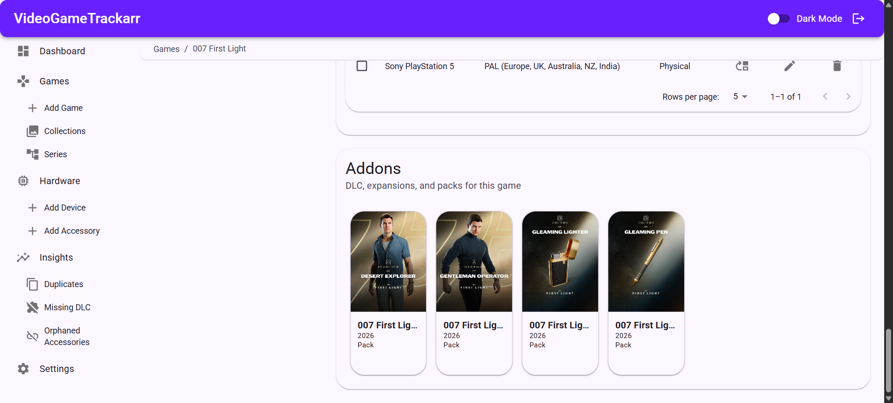

<p align="center">
  
</p>

<h1 align="center">VideoGameTrackarr</h1>

A self-hosted web app for tracking your video game collection: what you own, what you want,
what you're playing, and how it's going.

## Screenshots







## Features

- **Library tracking** — owned games and a wishlist, per platform/region/format (physical,
  digital, ISO, ROM), with notes on edition and storefront.
- **IGDB-powered catalog** — search and import from IGDB, including genres, developers/
  publishers, franchises, collections, platforms, screenshots, artwork, videos, and release
  dates. Addons (DLC/expansions/packs) import and resync alongside their parent game.
- **Personal tracking** — play status, playtime, a 0–10 rating with review, individual play
  sessions, free-form notes, and tags.
- **Library intelligence** — duplicate detection, missing-DLC detection, and flagging accessories
  that aren't linked to hardware you own.
- **Dashboard** — collection stats, an upcoming-release calendar for your wishlist, and
  side-by-side game comparison.
- **Data portability** — CSV export (library and hardware), and a full JSON backup/restore (with
  an automatic safety snapshot taken before any restore).
- **PWA** — installable, works offline for anything you've already viewed (TanStack Query's
  cache persists to IndexedDB), and queues edits made while offline to sync automatically on
  reconnect.
- **Material 3 design**, light/dark mode, responsive navigation (bottom bar / rail / drawer
  depending on screen size), virtualized lists for large collections.
- Single-admin, self-hosted — no public registration, no multi-tenancy.

## Prerequisites

- Git: https://git-scm.com/downloads
- Node.js 22+: https://nodejs.org/en/download/current
- Python 3.12+: https://www.python.org/downloads/

## Install

```
git clone https://github.com/wwwescape/VideoGameTrackarr.git
cd VideoGameTrackarr
npm install
cd backend
python -m venv .venv
.venv\Scripts\activate          # Windows; use `source .venv/bin/activate` on macOS/Linux
pip install -r requirements-dev.txt
cd ..
```

## Configure

Create a `.env` file in the project root (see `.env.example`):

```
IGDB_CLIENT_ID=your_igdb_client_id
IGDB_CLIENT_SECRET=your_igdb_client_secret
JWT_SECRET_KEY=            # generate with: python -c "import secrets; print(secrets.token_hex(32))"
```

Get IGDB credentials at https://api-docs.igdb.com/#getting-started (free, requires a Twitch
developer account). See `.env.example` for the rest (database URL, Redis, CORS — all
optional with sane defaults).

## Set up the database

```
cd backend
alembic upgrade head
```

## Run (development)

Two processes, two terminals, from the project root:

```
cd backend && .venv\Scripts\activate && uvicorn app.main:app --reload --port 8000
```

```
npm start
```

The frontend runs on `http://localhost:3000` (Vite) and talks to the backend on
`http://localhost:8000` (FastAPI) — CORS is pre-configured for this pair. Since the `users`
table starts empty, visiting the app shows a create-admin form instead of the login form —
fill it in once and you're signed in. (If you ever get locked out afterward, `python -m
scripts.create_admin --username admin` from `backend/` resets the password.)

## Test

```
npm run lint && npm run typecheck && npm test && npm run build
cd backend && ruff check . && pytest
```

There's also a real-browser Playwright suite covering critical user journeys end to end —
see `e2e/README.md`. It's a manual pre-release check, not something CI runs automatically,
so it needs a bit of one-time setup against a scratch copy of your database before running
`npm run test:e2e`.

## Deploy with Docker Compose

The published image bundles the frontend and backend into a single container — one origin,
no separate frontend container or proxy split needed.

Create `docker-compose.yml`:

```yaml
services:
  app:
    image: wwwescape/videogametrackarr:latest
    container_name: videogametrackarr
    ports:
      - "8000:8000"
    env_file:
      - .env
    volumes:
      - db-data:/app/backend/db
      - uploads-data:/app/backend/uploads
    restart: unless-stopped

volumes:
  db-data:
  uploads-data:
```

Create a `.env` file next to it (see `.env.example`) with `IGDB_CLIENT_ID`,
`IGDB_CLIENT_SECRET`, and `JWT_SECRET_KEY` filled in.

Then run:

```
docker compose up -d
```

Then open `http://localhost:8000` in your browser — with no admin account yet, you'll land
on a create-admin form instead of login. Fill it in once and you're signed in (there's no
public registration beyond that first-run form). If you ever get locked out afterward,
`docker compose exec app python -m scripts.create_admin --username admin` resets the
password.

Migrations run automatically on container start. Both the SQLite database and uploaded
cover/accessory images live in the named volumes above, so they survive `docker compose
down`/recreates and upgrades — only `docker compose down -v` removes them.

This repo's own [docker-compose.yml](docker-compose.yml) is the same setup with a couple
extras: a comment showing how to build from source instead of pulling the image, and an
optional shared Redis cache (`docker compose --profile redis up -d`) that's only useful if
you run more than one replica — a single instance already gets an in-process cache for free.
Reverse proxy examples (Nginx, Traefik) for fronting this with your own TLS/domain are in
`docs/deployment/`.

## Upgrading

Schema changes ship as Alembic migrations, applied automatically — there's no separate
upgrade step beyond getting the new code running:

- **Docker**: `docker compose pull && docker compose up -d` (or `git pull && docker compose
  up -d --build` if you've switched `docker-compose.yml` to build from source instead of
  pulling the published image). The entrypoint runs `alembic upgrade head` before the app
  starts, every time the container starts. Your data (database + uploads) is untouched — it
  lives in the named volumes described above, not in the container itself.
- **Bare metal**: `git pull`, reinstall dependencies if `requirements.txt`/`package.json`
  changed (`pip install -r requirements-dev.txt`, `npm install`), then run `cd backend &&
  alembic upgrade head` before starting the app again.

Occasionally a migration drops a column or table that turned out to be unused — when that
happens it's called out in that release's notes. Routine schema changes (new columns, new
tables) never touch existing data.

## Release a new version

```
git tag v1.2.0
git push origin v1.2.0
```

That tag push builds and publishes a Docker image to both GHCR
(`ghcr.io/<owner>/<repo>`) and Docker Hub (`docker.io/wwwescape/videogametrackarr`) —
tagged with that version and `latest` — and creates a GitHub Release with auto-generated
notes. See `.github/workflows/release.yml`; publishing to Docker Hub needs the
`DOCKERHUB_USERNAME`/`DOCKERHUB_TOKEN` repository secrets set.

## Project layout

```
frontend/   TypeScript, Vite, MUI, TanStack Query, React Router — own package.json
backend/    FastAPI, SQLAlchemy, Alembic (SQLite by default) — own requirements.txt
e2e/        Playwright end-to-end suite (manual pre-release check)
docs/       developer guide, architecture diagrams, deployment examples
```

See `docs/developer-guide.md` for conventions and where to add things, `frontend/README.md`
and `backend/README.md` for the details of each half, and `CONTRIBUTING.md` if you're
sending a PR.

## TODO

P2:
- [ ] Source reference images for predefined devices and accessories.
- [ ] Investigate possible integrations with Steam, HowLongToBeat.com, and others.

P5:
- [ ] If we can obtain a list of editions for predefined devices and accessories, remove the
      Edition field and replace it with a dynamic Editions dropdown.
- [ ] Add bulk resync for multiple selected games (bulk delete and bulk compare already exist
      in `GameListToolbar`).
- [ ] Create Android and iOS companion apps.

## License

GPL-3.0 — see `LICENSE`.

## Support

If you find VideoGameTrackarr useful, consider buying me a coffee:

[](https://buymeacoffee.com/wwwescape)
