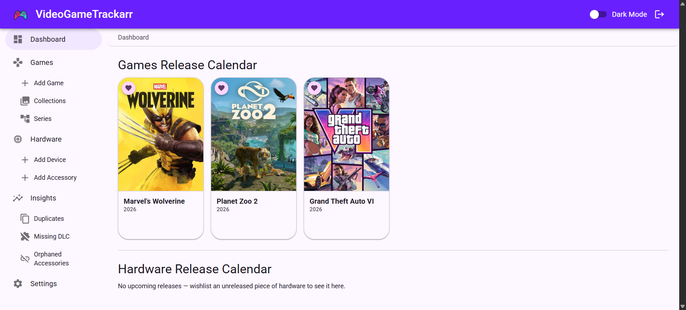
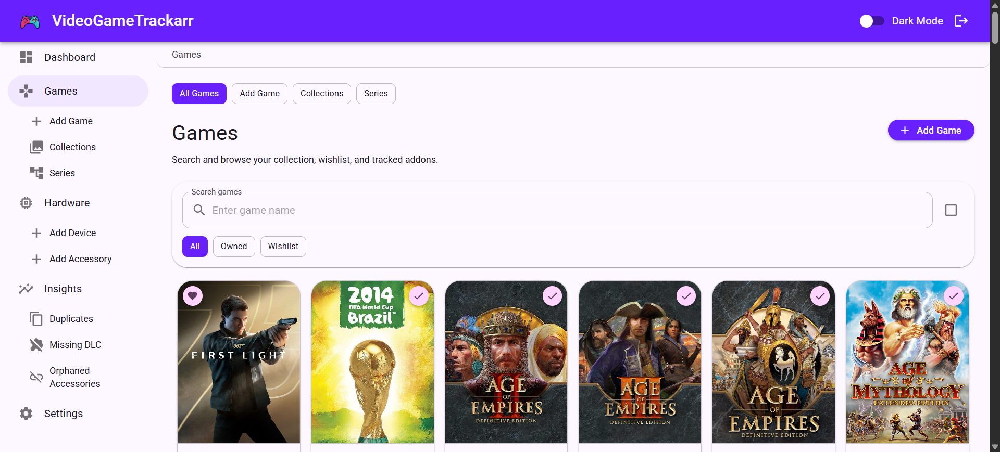
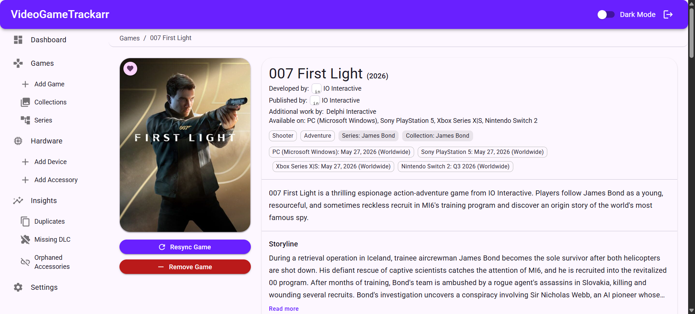
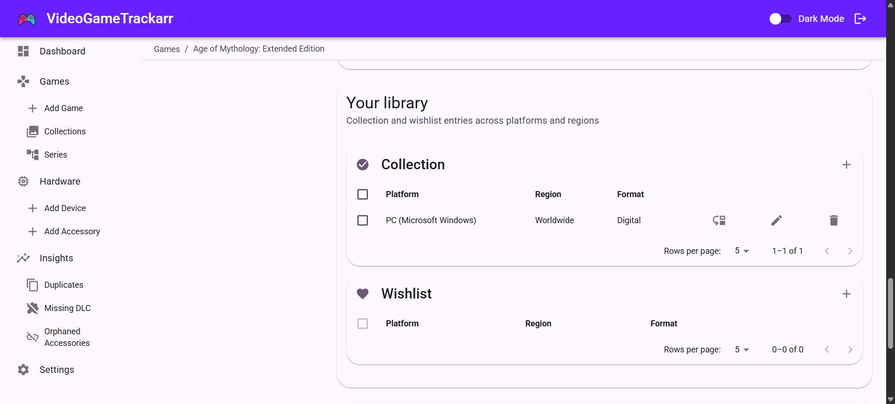
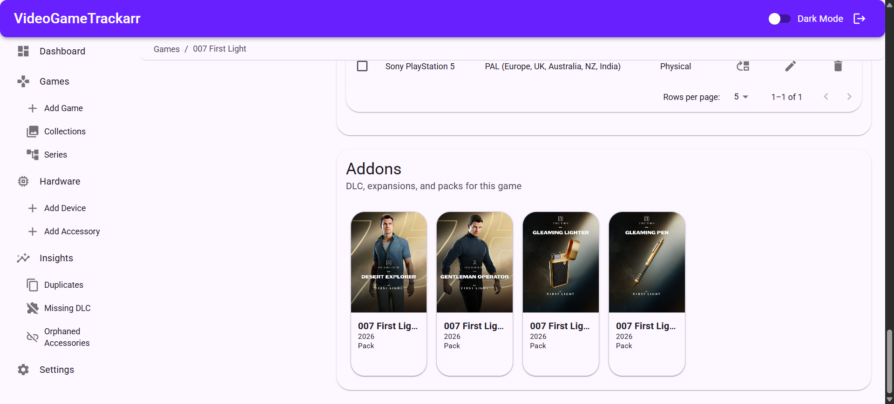

<p align="center">
  
</p>

<h1 align="center">VideoGameTrackarr</h1>

A self-hosted web app for tracking your video game collection: what you own, what you want,
what you're playing, and how it's going — with Steam library sync and automatic wishlist
sale-price tracking (PC/Mac/Linux/Android via IsThereAnyDeal, PlayStation via PlatPrices) so
you know what's worth grabbing next.

## Screenshots







## Features

- **Library tracking** — owned games and a wishlist, per platform/region/format (physical,
  digital, ISO, ROM), with notes on edition and storefront.
- **IGDB-powered catalog** — search and import from IGDB, including genres, developers/
  publishers, franchises, collections, platforms, screenshots, artwork, videos, and release
  dates. Addons (DLC/expansions/packs) import and resync alongside their parent game.
- **Personal tracking** — play status, playtime, and a 0–10 rating with review, tracked
  separately per platform you own a game on; plus individual play sessions, free-form notes,
  and tags with custom colors (managed from a dedicated Tag Manager).
- **External integrations** (all optional, off by default — see Configure below):
  - **Steam** — import your owned games and their playtime, matched against your catalog, and
    apply the sync one row (or many) at a time — nothing is ever written silently.
  - **IsThereAnyDeal** and **PlatPrices** track sale prices for your wishlist (PC/Mac/Linux/
    Android via ITAD, PlayStation via PlatPrices) and surface them on the dashboard's On Sale
    section, with an optional per-item target price.
- **In-browser play** — attach a ROM to an owned ROM/Abandonware/ISO copy and play it right
  from the game's page via a self-hosted [EmulatorJS](https://github.com/EmulatorJS/EmulatorJS)
  (no CDN, nothing leaves your server), with save states and in-game saves kept on the server.
  Over 25 systems are playable today — cartridge consoles from NES to N64 and DS, PlayStation,
  Sega CD, Saturn, 3DO, PC Engine CD, DOS and PSP among them — with BIOS files uploaded once in
  Settings → Emulation for the systems that need them. Bring your own files — see In-browser
  play below.
- **Media viewer** — an in-app lightbox for screenshots and artwork (zoom, fullscreen,
  thumbnail filmstrip) and a video gallery with thumbnail previews, instead of opening raw
  URLs in a new tab.
- **Public share links** — generate an unauthenticated, unlisted read-only link to your Games
  or Hardware collection from Settings → Share, for showing it off without giving out your
  login.
- **Library intelligence** — duplicate detection, missing-addon detection, and flagging
  accessories that aren't linked to hardware you own.
- **Dashboard** — collection stats, an upcoming-release calendar for your wishlist, and
  side-by-side game comparison.
- **Data portability** — CSV export (library and hardware), and a full JSON backup/restore (with
  an automatic safety snapshot taken before any restore) — optionally as a .zip that also
  carries your ROMs, saves and BIOS files.
- **PWA** — installable, works offline for anything you've already viewed (TanStack Query's
  cache persists to IndexedDB), and queues edits made while offline to sync automatically on
  reconnect.
- **Material 3 design**, light/dark mode, responsive navigation (bottom bar / rail / drawer
  depending on screen size), virtualized lists for large collections.
- Single-admin, self-hosted — no public registration, no multi-tenancy.

## Prerequisites

- Git: https://git-scm.com/downloads
- Node.js 22+: https://nodejs.org/en/download/current
- Python 3.12+: https://www.python.org/downloads/

## Install

```
git clone https://github.com/wwwescape/VideoGameTrackarr.git
cd VideoGameTrackarr
npm install
cd backend
python -m venv .venv
.venv\Scripts\activate          # Windows; use `source .venv/bin/activate` on macOS/Linux
pip install -r requirements-dev.txt
cd ..
```

## Configure

Create a `.env` file in the project root (see `.env.example`):

```
IGDB_CLIENT_ID=your_igdb_client_id
IGDB_CLIENT_SECRET=your_igdb_client_secret
JWT_SECRET_KEY=            # generate with: python -c "import secrets; print(secrets.token_hex(32))"
```

Get IGDB credentials at https://api-docs.igdb.com/#getting-started (free, requires a Twitch
developer account). See `.env.example` for the rest (database URL, Redis, CORS — all
optional with sane defaults).

### Optional: external integrations

IGDB is the only hard requirement — Steam sync and sale-price tracking are each independently
optional. Enable any of them by uncommenting its block in `.env.example`, filling it in, and
restarting:

- **Steam** (`STEAM_API_KEY`) — free at https://steamcommunity.com/dev/apikey. Your SteamID64
  isn't a secret and is set separately, in-app under Settings → Integrations, not in `.env`.
- **IsThereAnyDeal** (`ITAD_API_KEY`) — free at https://isthereanydeal.com/apps/my/. Covers
  PC/Mac/Linux/Android wishlist prices.
- **PlatPrices** (`PLATPRICES_API_KEY`) — an application-reviewed free key, usually issued
  within 1-2 business days: https://platprices.com/api-request. Covers PlayStation wishlist
  prices. Its free tier only tracks **2 PS Store regions at a time**, chosen on your PlatPrices
  dashboard and changeable once every 24 hours — `PLATPRICES_REGION` in `.env` must match one
  of them, or prices will reflect the wrong region.

Each configured integration shows a live Configured/Not configured status in
Settings → Integrations. Steam Sync itself lives under Settings → Steam Sync; ITAD/PlatPrices
results surface under Insights → On Sale and the dashboard's On Sale teaser. All three refresh
on a schedule you can review and adjust under Settings → Jobs.

### In-browser play (ROMs)

Owned copies with a **ROM**, **Abandonware**, or **ISO** format get a ROM files list in the
Your Library dialog. A copy can hold several files (say, two regions or revisions), each with an
optional label, and each can be the ROM/disc image itself or a `.zip`/`.7z` of it (a disc's
`.cue` + `.bin` files, or a multi-disc set with an `.m3u`, go in one archive). When a copy's
platform and file type match a bundled emulator core, a **Play Game** button appears on the
game's page (under Resync/Remove), listing each uploaded ROM by platform and label. Each ROM
in the dialog can be replaced, downloaded back (its original file) or removed.

**Saves live on the server**, so they survive clearing your browser and follow you to another
device:

- **Save states** — the player's Save State button stores a snapshot (with a screenshot) in
  VGT, as many as you like; its Load State button opens a picker of them, and **Resume…** in
  the Play Game dialog starts the game from one. Delete old ones from either picker.
- **In-game saves** — a game's own save (the battery save a cartridge would keep) syncs to VGT
  automatically every minute and when you close the player, and is loaded back in the next
  time you play, on any browser.
- Replacing or removing a ROM deletes its saves too (only that ROM's) — they only work with
  the exact file they were made on.

- **Playable today** (zipped or not): NES/Famicom, SNES/Super Famicom, Game Boy/Color, Game
  Boy Advance, Nintendo 64, Nintendo DS, Virtual Boy, Sega Genesis/Mega Drive, Master System,
  Game Gear, 32X, Atari 2600/7800/Jaguar, PC Engine/TurboGrafx-16/SuperGrafx, Neo Geo Pocket/
  Color, WonderSwan/Color, PlayStation, and DOS (any `.zip` of the game's folder, including
  Abandonware copies). ROMs can only be uploaded for these platforms — for any other, the
  dialog shows a note instead of the upload field. **Arcade isn't included**: the only EmulatorJS arcade core (FinalBurn Neo) forbids
  use by projects that take donations.
- **BIOS systems** — Sega CD, Saturn, 3DO, PC Engine CD, Atari Lynx, Atari 5200, ColecoVision and
  Famicom Disk System need the console's own BIOS file (PlayStation and Saturn have a built-in
  fallback, but some games run better with the real one). Upload them once in **Settings →
  Emulation**, which lists the exact file names each system accepts and flags whether your
  dump matches a known-good checksum. As with ROMs, dump them from consoles you own — VGT never
  downloads or includes BIOS files.
- **DOS and PSP open in a new tab**. Their emulator cores need SharedArrayBuffer, which browsers
  only allow on a cross-origin-isolated page, so they play in a separate player page served
  with `Cross-Origin-Opener-Policy`/`Cross-Origin-Embedder-Policy` headers (set by VGT itself;
  a reverse proxy must pass them through unchanged). PSP also needs WebGL2. Saves work the same
  as in the in-page player; closing the tab directly (instead of the player's close button) can
  lose up to the last minute of in-game progress.
- **Licenses**: the SNES (Snes9x), Genesis family and Sega CD (Genesis Plus GX), 32X (PicoDrive)
  and 3DO (Opera) cores are free to redistribute but for **non-commercial use only**; every
  bundled core and its license is listed on the About page.
- **Bring your own files** — VGT never hosts, distributes, or helps find ROMs. Only upload
  games you legally own.
- **Size limit**: `ROM_MAX_UPLOAD_MB` in `.env` (default 2048). If you run VGT behind a
  reverse proxy, raise its request body limit to match — Nginx's default is only 1 MB (see
  `docs/deployment/nginx.example.conf`).
- ROMs and their saves are stored under `backend/uploads/roms/` (the same Docker volume as
  other uploads) but are never publicly served — ROMs only through short-lived signed links,
  saves only to your logged-in session. BIOS files live under `backend/uploads/roms/bios/`,
  just as private.
- **Backups**: the JSON backup leaves ROMs, saves and BIOS files out (a restore on the same
  instance keeps ROMs, and their saves, whose copy still exists). Tick **Include ROMs, saves
  and BIOS files** in Settings → Data Management to download a `.zip` full backup instead —
  as large as all your ROMs together, streamed straight to disk. Restoring that `.zip` (Restore
  accepts either) replaces ROMs, saves and BIOS files along with everything else; behind a
  reverse proxy, its request body limit applies to restores too.

EmulatorJS (GPL-3.0) and each bundled core (under its own license) are credited on the About
page. They're downloaded from the npm registry at build time — pinned and integrity-checked —
by `frontend/scripts/vendor-emulatorjs.mjs`, which runs automatically before `npm run start`
and `npm run build`.

## Set up the database

```
cd backend
alembic upgrade head
```

## Run (development)

Two processes, two terminals, from the project root:

```
cd backend && .venv\Scripts\activate && uvicorn app.main:app --reload --port 8000
```

```
npm start
```

The frontend runs on `http://localhost:3000` (Vite) and talks to the backend on
`http://localhost:8000` (FastAPI) — CORS is pre-configured for this pair. Since the `users`
table starts empty, visiting the app shows a create-admin form instead of the login form —
fill it in once and you're signed in. (If you ever get locked out afterward, `python -m
scripts.create_admin --username admin` from `backend/` resets the password.)

## Test

```
npm run lint && npm run typecheck && npm test && npm run build
cd backend && ruff check . && pytest
```

There's also a real-browser Playwright suite covering critical user journeys end to end —
see `e2e/README.md`. It's a manual pre-release check, not something CI runs automatically,
so it needs a bit of one-time setup against a scratch copy of your database before running
`npm run test:e2e`.

## Deploy with Docker Compose

The published image bundles the frontend and backend into a single container — one origin,
no separate frontend container or proxy split needed.

Create `docker-compose.yml`:

```yaml
services:
  app:
    image: wwwescape/videogametrackarr:latest
    container_name: videogametrackarr
    ports:
      - "8000:8000"
    env_file:
      - .env
    volumes:
      - db-data:/app/backend/db
      - uploads-data:/app/backend/uploads
    restart: unless-stopped

volumes:
  db-data:
  uploads-data:
```

Create a `.env` file next to it (see `.env.example`) with `IGDB_CLIENT_ID`,
`IGDB_CLIENT_SECRET`, and `JWT_SECRET_KEY` filled in.

Then run:

```
docker compose up -d
```

Then open `http://localhost:8000` in your browser — with no admin account yet, you'll land
on a create-admin form instead of login. Fill it in once and you're signed in (there's no
public registration beyond that first-run form). If you ever get locked out afterward,
`docker compose exec app python -m scripts.create_admin --username admin` resets the
password.

Migrations run automatically on container start. Both the SQLite database and uploaded
cover/accessory images live in the named volumes above, so they survive `docker compose
down`/recreates and upgrades — only `docker compose down -v` removes them.

This repo's own [docker-compose.yml](docker-compose.yml) is the same setup with a couple
extras: a comment showing how to build from source instead of pulling the image, and an
optional shared Redis cache (`docker compose --profile redis up -d`) that's only useful if
you run more than one replica — a single instance already gets an in-process cache for free.
Reverse proxy examples (Nginx, Traefik) for fronting this with your own TLS/domain are in
`docs/deployment/`.

## Upgrading

Schema changes ship as Alembic migrations, applied automatically — there's no separate
upgrade step beyond getting the new code running:

- **Docker**: `docker compose pull && docker compose up -d` (or `git pull && docker compose
  up -d --build` if you've switched `docker-compose.yml` to build from source instead of
  pulling the published image). The entrypoint runs `alembic upgrade head` before the app
  starts, every time the container starts. Your data (database + uploads) is untouched — it
  lives in the named volumes described above, not in the container itself.
- **Bare metal**: `git pull`, reinstall dependencies if `requirements.txt`/`package.json`
  changed (`pip install -r requirements-dev.txt`, `npm install`), then run `cd backend &&
  alembic upgrade head` before starting the app again.

Occasionally a migration drops a column or table that turned out to be unused — when that
happens it's called out in that release's notes. Routine schema changes (new columns, new
tables) never touch existing data.

## Release a new version

```
git tag v1.2.0
git push origin v1.2.0
```

That tag push builds and publishes a Docker image to both GHCR
(`ghcr.io/<owner>/<repo>`) and Docker Hub (`docker.io/wwwescape/videogametrackarr`) —
tagged with that version and `latest` — and creates a GitHub Release with auto-generated
notes. See `.github/workflows/release.yml`; publishing to Docker Hub needs the
`DOCKERHUB_USERNAME`/`DOCKERHUB_TOKEN` repository secrets set.

## Project layout

```
frontend/   TypeScript, Vite, MUI, TanStack Query, React Router — own package.json
backend/    FastAPI, SQLAlchemy, Alembic (SQLite by default) — own requirements.txt
e2e/        Playwright end-to-end suite (manual pre-release check)
docs/       developer guide, architecture diagrams, deployment examples
```

See `docs/developer-guide.md` for conventions and where to add things, `frontend/README.md`
and `backend/README.md` for the details of each half, and `CONTRIBUTING.md` if you're
sending a PR.

## TODO

P2:
- [ ] Source reference images for predefined devices and accessories.
- [ ] Investigate a possible integration with HowLongToBeat.com.

P5:
- [ ] If we can obtain a list of editions for predefined devices and accessories, remove the
      Edition field and replace it with a dynamic Editions dropdown.
- [ ] Add bulk resync for multiple selected games (bulk delete and bulk compare already exist
      in `GameListToolbar`).
- [ ] Create Android and iOS companion apps.

## License

GPL-3.0 — see `LICENSE`.

## Support

If you find VideoGameTrackarr useful, consider buying me a coffee:

[](https://buymeacoffee.com/wwwescape)
