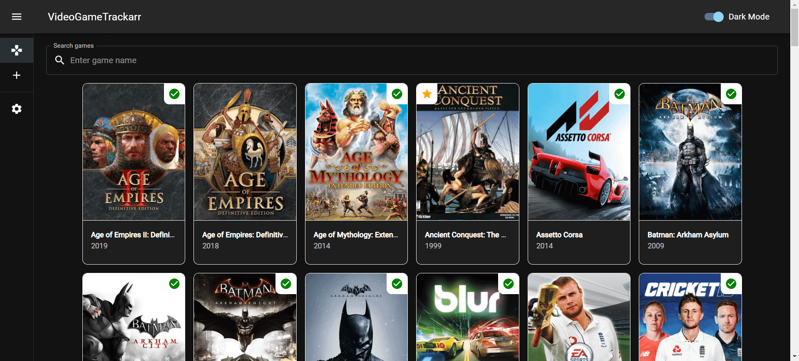

# VideoGameTrackarr

---

## A self-hosted web application to track your video game collection

---

## Screenshots





---

## Prerequisites
- Git: https://git-scm.com/downloads
- Node: https://nodejs.org/en/download/current

## How to install
Open a command prompt / Git Bash and type the following commands:
```
git clone https://github.com/wwwescape/VideoGameTrackarr.git
cd VideoGameTrackarr
npm install --legacy-peer-deps
```

## How to run

### Backend
Open a command prompt / Git Bash and type the following commands:
```
cd server
node index.js
```
The backend server will start on `localhost:3001`.

### Frontend
Open a command prompt / Git Bash and type the following commands:
```
npm run build
npm install -g serve
serve -s build
```
The web application will start on `localhost:3000`.

## Disclaimer
Please note that this is still in an early alpha/beta phase. I will eventually package the backend and frontend into separate Docker images that you can deploy.


## 🤓 This project follows the Monorepo approach

Which means:

- `server/` folder contains all the logic for the backend to be self-hosted.
- `src/` folder contains all the logic for the backend to be self-hosted.

## To-Do

- [ ] Separate the backend and frontend package.json files and create Dockerfiles for each
- [ ] Package the backend and frontend into a docker app for easy deployment
- [ ] Improve the UI :)
- [ ] Add basic filtering support on the games page
- [ ] Use URL slugs instead of IDs in the URLs
- [ ] Optimize rendering of large datasets using libraries such as [react-virtualized](https://github.com/bvaughn/react-virtualized), [react-window](https://github.com/bvaughn/react-window) or [react-virtuoso](https://github.com/petyosi/react-virtuoso)
- [ ] Check possible integrations with Steam, HowLongToBeat.com, and others
- [ ] Create Android & iOS companion apps
- [ ] Automate workflows using Github Actions
- [ ] Transform backend from a monolithic architecture to microservices architecture