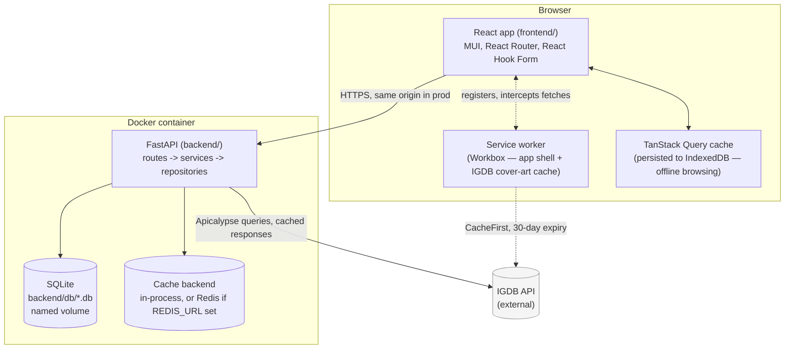
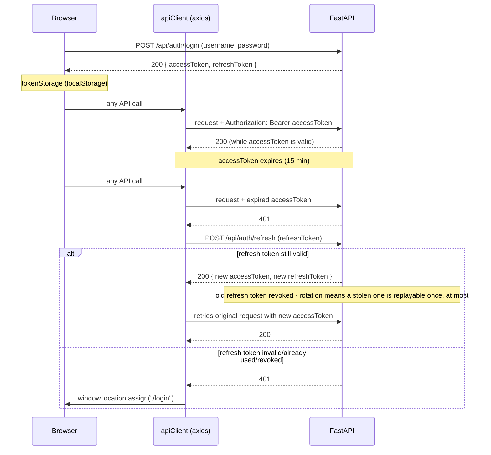

# Architecture diagrams

Companion to [developer-guide.md](developer-guide.md). These two diagrams capture the
system's shape — components and the auth flow, the two things that are hardest to hold in
your head from reading code alone. Both render natively on GitHub (Mermaid).

## System components

A few things this makes explicit that aren't obvious from the directory layout alone:

- **One origin, not two.** The frontend and backend are drawn as one deployable unit (the
  Docker container described in the root README) — FastAPI serves the built frontend
  itself, not a separate Nginx/static host. `frontend/api/client.ts`'s `API_BASE_URL` logic
  only branches for local dev, where Vite (`:3000`) and FastAPI (`:8000`) really are
  separate origins.
- **Two independent caching layers**, deliberately not unified: TanStack Query persists
  *parsed application data* (so the game list/details/dashboard are browsable offline from
  a cold start); the service worker separately caches *IGDB's cover images* (raw bytes,
  which the data-layer cache was never going to hold). Conflating them would mean one cache
  doing a job it's not shaped for.
- **The cache backend is a `Protocol`, not a hard Redis dependency** (`app/services/cache.py`)
  — a single self-hosted instance gets an in-process TTL cache for free; Redis is additive,
  not required (see the docker-compose `redis` profile).

## Auth flow (login, then a token refresh)

The retry-once-then-redirect logic and the concurrent-request queueing while a refresh is
in flight both live in `frontend/api/client.ts`'s response interceptor — worth reading
alongside this diagram if you're touching auth, since the sequence above is the *intended*
behavior the interceptor's queueing exists to preserve correctly under concurrency.
